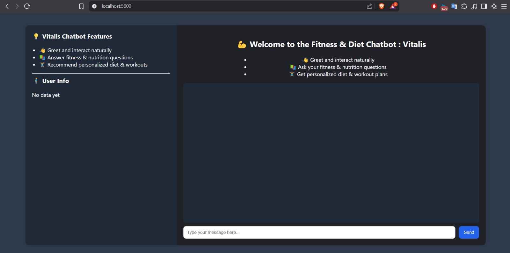
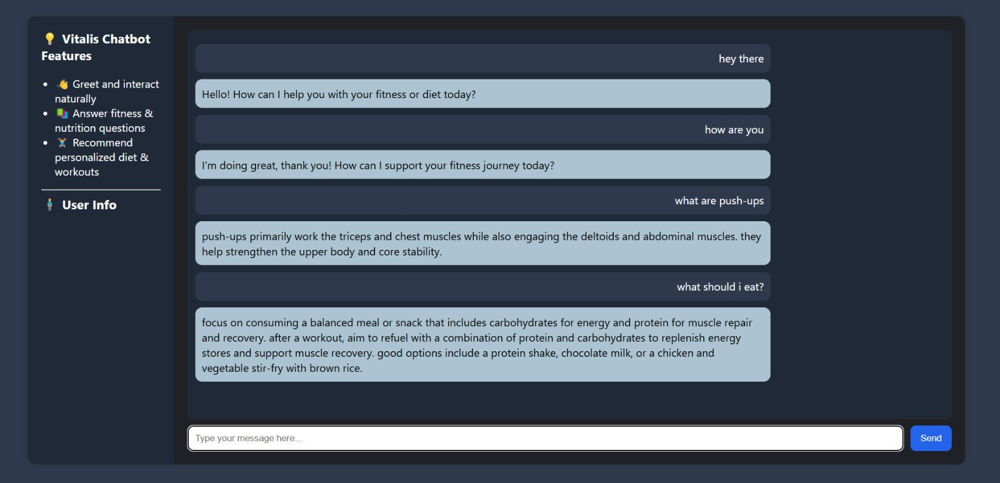
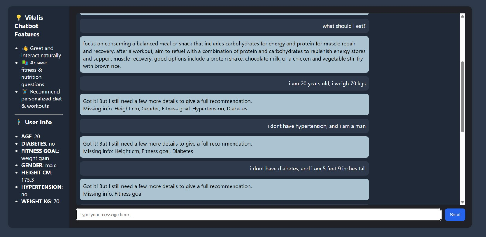
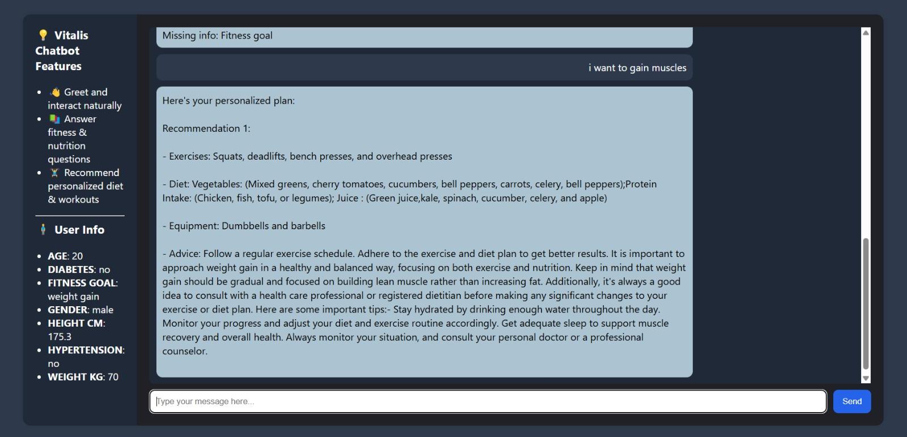

# 🏋️‍♂️ **Vitalis – Personalized Fitness & Diet Chatbot**  
*Python · PyTorch · RoBERTa · Sentence-Transformers · spaCy · Flask*

Vitalis is an intelligent fitness chatbot that provides personalized diet and workout plans by understanding user goals through natural language. It combines powerful NLP models with real-world data to deliver interactive, real-time fitness guidance.

---

## 🚀 How It Works

### 🧠 Step-by-Step Workflow:

1. **User Input**  
   The chatbot receives a natural language message from the user (e.g., "I want to lose weight").

2. **Intent Classification**  
   The input is passed to the `RoBERTaIntentClassifier` to determine the intent.  
   It can classify into one of the following:
   - `greeting` (e.g., "Hi", "Hello")
   - `query` (general fitness questions)
   - `providing_info` (user provides height, weight, age, goal, etc.)

3. **Intent Handling Logic**
   - **Greeting**  
     Uses **Sentence Transformers** to retrieve an appropriate response from a greeting response pool using semantic similarity.
   
   - **Query Handling**  
     There are **two datasets**:
     - An ordered Q&A dataset (`qa_data.csv`) containing common fitness questions.
     - A web-scraped Wikipedia fitness article (`raw_info.txt`).

     The user query is first compared to the Q&A dataset using **cosine similarity**.  
     If no high-confidence match is found, the query is answered using **`roberta-base-squad2`** applied on the Wikipedia article via a QA pipeline.

   - **Personalized Recommendation**  
     If the intent is `providing_info`, the chatbot extracts user data using:
     - **spaCy NER** for height, weight, age, gender, fitness goal
     - **Regex patterns** for structured fallback extraction

     Once all required data is received, it is preprocessed and passed to a **PyTorch-based recommendation model**, trained on **15,000+ real-world samples**, to generate personalized:
     - Diet Plans 🥗  
     - Workout Plans 🏃

---

## 💻 Web Interface

The chatbot is deployed as a **Flask web app** with:
- HTML + CSS frontend
- Real-time conversation updates
- Dynamic display of extracted user details and responses

> 📸 **Interface Snapshots**

  
  
  
  
  

---

